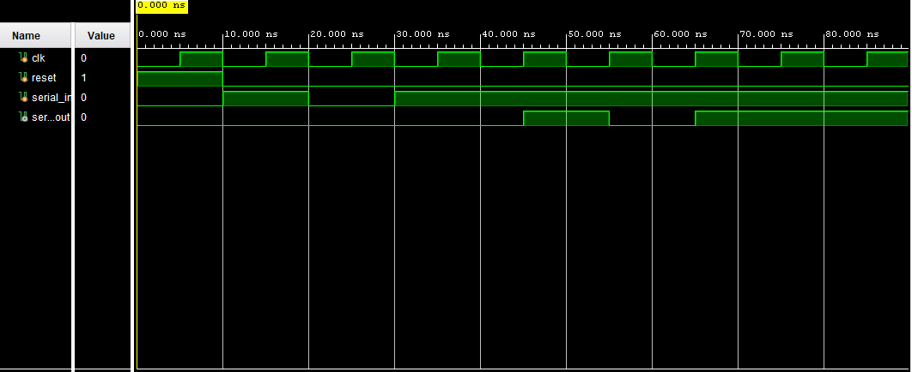

# Verilog Shift Register Designs

This repository contains the implementation and simulation of the four fundamental shift register architectures using Verilog HDL:

- SISO (Serial In Serial Out)
- SIPO (Serial In Parallel Out)
- PISO (Parallel In Serial Out)
- PIPO (Parallel In Parallel Out)

All designs were developed and verified using Vivado through behavioral simulation and waveform analysis.

# 1. SISO Shift Register

## Verilog Code

```verilog
module siso(
    input clk,
    input reset,
    input serial_in,
    output serial_out
);

reg [3:0] shift_reg;

always @(posedge clk or posedge reset)
begin
    if(reset)
        shift_reg <= 4'b0000;
    else
        shift_reg <= {shift_reg[2:0], serial_in};
end

assign serial_out = shift_reg[3];

endmodule
```

## Testbench

```verilog
`timescale 1ns / 1ps

module siso_tb;

reg clk;
reg reset;
reg serial_in;

wire serial_out;

siso uut(
    .clk(clk),
    .reset(reset),
    .serial_in(serial_in),
    .serial_out(serial_out)
);

always #5 clk = ~clk;

initial begin

    clk = 0;
    reset = 1;
    serial_in = 0;

    #10;
    reset = 0;

    serial_in = 1; #10;
    serial_in = 0; #10;
    serial_in = 1; #10;
    serial_in = 1; #10;

    #40;

    $finish;

end

endmodule
```

## Waveform



## Waveform Explanation

The serial input bits are shifted through the register on every positive edge of the clock.

Input sequence:

```text
1 → 0 → 1 → 1
```

Register contents:

```text
0000
0001
0010
0101
1011
```

The first input bit reaches the serial output after passing through all four stages.

---

# 2. SIPO Shift Register

## Verilog Code

```verilog
module sipo(
    input clk,
    input reset,
    input serial_in,
    output reg [3:0] parallel_out
);

always @(posedge clk or posedge reset)
begin
    if(reset)
        parallel_out <= 4'b0000;
    else
        parallel_out <= {parallel_out[2:0], serial_in};
end

endmodule
```

## Testbench

```verilog
`timescale 1ns / 1ps

module sipo_tb;

reg clk;
reg reset;
reg serial_in;

wire [3:0] parallel_out;

sipo uut(
    .clk(clk),
    .reset(reset),
    .serial_in(serial_in),
    .parallel_out(parallel_out)
);

always #5 clk = ~clk;

initial begin

    clk = 0;
    reset = 1;
    serial_in = 0;

    #10;
    reset = 0;

    serial_in = 1; #10;
    serial_in = 0; #10;
    serial_in = 1; #10;
    serial_in = 1; #10;

    #20;

    $finish;

end

endmodule
```

## Waveform


## Waveform Explanation

Input sequence:

```text
1 → 0 → 1 → 1
```

Observed register values:

```text
0 → 1 → 2 → 5 → B
```

Final parallel output:

```text
1011
```

The waveform confirms successful serial-to-parallel conversion.

---

# 3. PISO Shift Register

## Verilog Code

```verilog
module piso(
    input clk,
    input reset,
    input load,
    input [3:0] parallel_in,
    output reg serial_out
);

reg [3:0] shift_reg;

always @(posedge clk or posedge reset)
begin
    if(reset)
        shift_reg <= 4'b0000;
    else if(load)
        shift_reg <= parallel_in;
    else
        shift_reg <= {shift_reg[2:0], 1'b0};
end

always @(*)
    serial_out = shift_reg[3];

endmodule
```

## Testbench

```verilog
`timescale 1ns / 1ps

module piso_tb;

reg clk;
reg reset;
reg load;
reg [3:0] parallel_in;

wire serial_out;

piso uut(
    .clk(clk),
    .reset(reset),
    .load(load),
    .parallel_in(parallel_in),
    .serial_out(serial_out)
);

// Clock generation
always #5 clk = ~clk;

initial
begin
    clk = 0;
    reset = 1;
    load = 0;
    parallel_in = 4'b0000;

    // Reset
    #10;
    reset = 0;

    // Load data 1011
    load = 1;
    parallel_in = 4'b1011;
    #10;

    // Start shifting
    load = 0;

    #50;

    $finish;
end

endmodule
```

## Waveform


## Waveform Explanation

Parallel data loaded:

```text
1011
```

After loading, data is shifted out serially.

Serial output sequence:

```text
1 → 0 → 1 → 1
```

The waveform confirms correct parallel-to-serial conversion.

---

# 4. PIPO Shift Register

## Verilog Code

```verilog
module pipo(
    input clk,
    input reset,
    input [3:0] parallel_in,
    output reg [3:0] parallel_out
);

always @(posedge clk or posedge reset)
begin
    if(reset)
        parallel_out <= 4'b0000;
    else
        parallel_out <= parallel_in;
end

endmodule
```

## Testbench

```verilog
`timescale 1ns / 1ps

module pipo_tb;

reg clk;
reg reset;
reg [3:0] parallel_in;

wire [3:0] parallel_out;

pipo uut(
    .clk(clk),
    .reset(reset),
    .parallel_in(parallel_in),
    .parallel_out(parallel_out)
);

// Clock generation
always #5 clk = ~clk;

initial
begin

    clk = 0;
    reset = 1;
    parallel_in = 4'b0000;

    // Reset
    #10;
    reset = 0;

    // Test Case 1
    parallel_in = 4'b1011;
    #10;

    // Test Case 2
    parallel_in = 4'b1100;
    #10;

    // Test Case 3
    parallel_in = 4'b0110;
    #10;

    // Test Case 4
    parallel_in = 4'b1111;
    #10;

    $finish;

end
endmodule
```

## Waveform


## Waveform Explanation

Input sequence:

```text
0 → B → C → 6 → F
```

Output sequence:

```text
0 → B → C → 6 → F
```

The entire 4-bit word is transferred simultaneously at every positive edge of the clock.

---

# Comparison of Shift Registers

| Register | Input | Output |
|-----------|--------|--------|
| SISO | Serial | Serial |
| SIPO | Serial | Parallel |
| PISO | Parallel | Serial |
| PIPO | Parallel | Parallel |

---

# Applications

- UART Communication
- SPI Interfaces
- Data Storage
- Digital Systems
- FPGA Design
- Embedded Systems

---

# Author

Farhana N S
